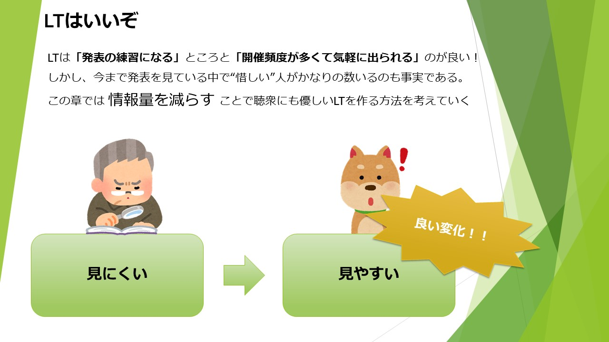

# 「わかりやすいLT」をつくる

びきニキ @BkNkbot

## はじめに

これまでの内容を見て、「LTしてみようかな」と思った人は多いはずです。（そうですよね？）本章では、発表に不慣れな人が陥りやすい”惜しいポイント”に触れながら、あなたの話すメッセージを少しだけ聞き手に届けやすくします。

## 情報量を減らす

言わずもがな、LTは「ライトニングトーク」の略です。**通常5分から10分程度の短時間でテンポよく行われるプレゼンテーションの一種**[^1]という位置付けのため、テンポの良い発表が求められます。

[^1]: TECH PLAY-ライトニングトークより引用　TECH PLAY:https://techplay.jp/tag/lightningtalks

サクサクと進む分、**聞き手が発表内容を理解しやすい工夫も必要**です。その中の基本が**情報量を減らす**こと。それではまず、以下の画像を見てください。

「パワーポイントを覚えたての大学生みたいなスライド」と書こうと思ったのですが、今どきの大学生でもこんなスライドは作りません。しかし、このようなスライドは誇張でもなく、本当によく見かけます。

みなさんはこのスライドを見て、どのように感じたでしょうか。例えばですが、このスライドには以下のような改善点があるのではないかと思います。

- スライドの核が目立っていない
- 行間が狭い
- テキストのサイズが小さい
- 図などを適切に利用できていない

### スライドの核が目立っていない
**「1スライド1メッセージ」**という考え方があります。非常に有名な考え方なのでご存知の方も多いと思いますが、上記のスライドではそれが守られていません。

1つのスライドに対して文字情報が多いと、聞き手が「何を伝えようとしているのか」を一生懸命考えなくてはいけません。さらに上記のスライド文章の中では”太字にしている部分”と”文字のサイズを大きくしている部分”が混在してしまっており、さらに情報量を増やす結果となっています。

文字のサイズを大きくしたり、太字にしたり、色を変えたり。やり方はいろいろとあると思いますが、**「1スライド1メッセージ」かつ「伝えたい核は目立たせる」**ことを忘れないようにしましょう！

### 行間が狭い・テキストのサイズが小さい
行間が狭かったり、テキストサイズが小さいと、1つのスライドに多くの文字を詰め込むことができます。つまり**「1つのスライドに多くの文字が詰め込める」ということは、上述した「1スライド1メッセージ」が守られないことに繋がります。**

そして、テキストサイズが小さいことで起こる弊害があと1つあります。**「スライドの文字が見えない」**ことです。

近年はコロナ禍の影響もありオンラインのイベントが増加してきましたが、もしこれがオフラインの登壇だったらどうでしょうか？…このようなスライド作成に慣れている状態で、もし登壇の機会に恵まれたら？

「オンラインのLT」という場だとしても、このようなスライド作成が習慣にならないように日々気をつけていく必要があります。**行間は気持ち広めに、テキストサイズは大胆に大きくすると、後ろの席でも見やすいスライドを作ることができます。**

ちなみに、著者がスライドを作成するときは行間を2.0、フォントサイズは最小で24にしていますが、これが絶対的な正解ではありません（ネタとして画面いっぱいに文字を敷き詰めることもあります）。

自分のスライド作成環境を考えたり、何度もLTに出ることで**自分にとっての適切な塩梅**を少しずつ見極めていきましょう！

### 図などを適切に利用出来ていない
突然ですが、**そのスライドの視覚効果や図、本当に必要ですか？**画面の賑やかしのために置いているだけじゃないですか？

絵や図などを使おう！という考えはとても素晴らしいものです。適切に利用すれば、複雑な要素を分かりやすく説明することもでき、聞き手の理解度をさらに高めることができます。

しかし、**適切に使われていない視覚効果や絵は、聞き手の混乱を招きます。**実際に上記のスライドでも、”文字が書いてある画面上部”より”図形や絵が多く置いてある画面下部”に注目してしまった人は多いのではないでしょうか。

複雑な概念などを説明するときなど「聞き手にイメージしてもらいたい」場合に絵を使ったりすることは有効ですが、「スペースが余っていて寂しいから」というような理由で**無駄にスライドを彩ることはやめましょう。**

上記のスライドを例に挙げると、図形描画する必要もなければ、グラデーションを使う必要もありません。そもそもパワーポイント標準の背景を使って彩る必要もありませんし、イラストを使う必要もありません。

また、ここでは再現していませんが、画面を切り替える度にアニメーションを付ける必要もありません。「ここぞ」という時に利用する分には構いませんが、かなりの頻度で文字がスライドインする資料だと見ている人は疲れます。「アニメーション」という余分な情報が増えているためです。**本当に重要なメッセージが伝わらなくなるので、視覚効果も最小限に抑えましょう。**

さて、著者スタイルで添削すると上記のようになりますが、こんな声も聞こえてきそうですね。「最初に出したスライドに比べると情報が不足している」「もっと詳しく説明したいこともある」などなど。

ここで思い出してほしいのは、”通常5分から10分程度の短時間でテンポよく行われるプレゼンテーションの一種”であるということです。**決まっているのは時間のみで、スライド枚数に規定はありません。**

筆者の場合は同じ情報を伝える際、「LTはいいぞ」「発表の練習になる」「開催頻度が多くて気軽に出られる」「情報量を減らす」というようなスライドを作って、計4枚で発表します（上記のスライドはその一部と捉えてください）。同じ情報を伝えるとしても”1枚に情報量を詰め込んで多くの時間を使う”より、後者の方がサクサクとテンポよく進んでいきますよね。

## 内容を丸読みしない

また、スライドを伝えたいメッセージだけにすることで発表の際にもメリットがあります。それは**「スライド内容を丸読み」しなくなること**です。

スライドに長文を書いて、それを丸読みするような発表だと、聞き手が退屈してしまいます。スライドが表示された時点で話す内容が分かっているからです。そのため、**さらに深掘りしたいことや補足したいことがある場合は「スライドには載せず、口頭で補足する」とよい**でしょう。

しかしこの方法を使うと、資料を後で公開する場合（そのスライドだけを見た人が誤解しないように）専用の補足スライドが必要となる場合もありますので、発表内容なども考えた上で実践すべきか判断してください。

### 台本を一言一句決めない
台本の内容をカッチリ決めすぎないことも重要です。一言一句しっかりと決めている人をたまに見かけますが、少しでも言い間違えた際に最初から言い直して時間をロスしてしまったり、逆に焦ってしまうケースが多発しているように感じます。

1から100まで全部台本に書き起こすのではなく、**箇条書きでもいいので「何を話すのか」をざっくり書いておくと良い**でしょう。そうすることで「ただ台本を読んでいる発表」ではなく**「（少しニュアンスは異なっても）自分の言葉でハキハキと伝える発表」へと変化**し、言葉にも抑揚がつきやすくなるため、ポジティブなイメージを抱きやすくなります。

また、時間調整をしやすくなるメリットもあります。話す内容をその場で組み立てるためです。時間が押している場合は省略する話、逆に余裕があった場合にする話など、**事前に話す内容にも優先度をつけて準備しておくとよいでしょう。**

## おわりに

**繰り返しますが、これまで書いた方法は「絶対的な正解」ではありません。**前提として私も”スライドの作り方”・”発表の仕方”はそれぞれのみなさんの個性が出た方が面白いと思っています。ここで見聞きした情報に捉われず、何度も場数を踏むことで、**自分にとっての「わかりやすいLT」を目指していきましょう！**

本章が少しでもあなたの手助けになれば幸いです。**みんな、LT会で会おうぜ！**