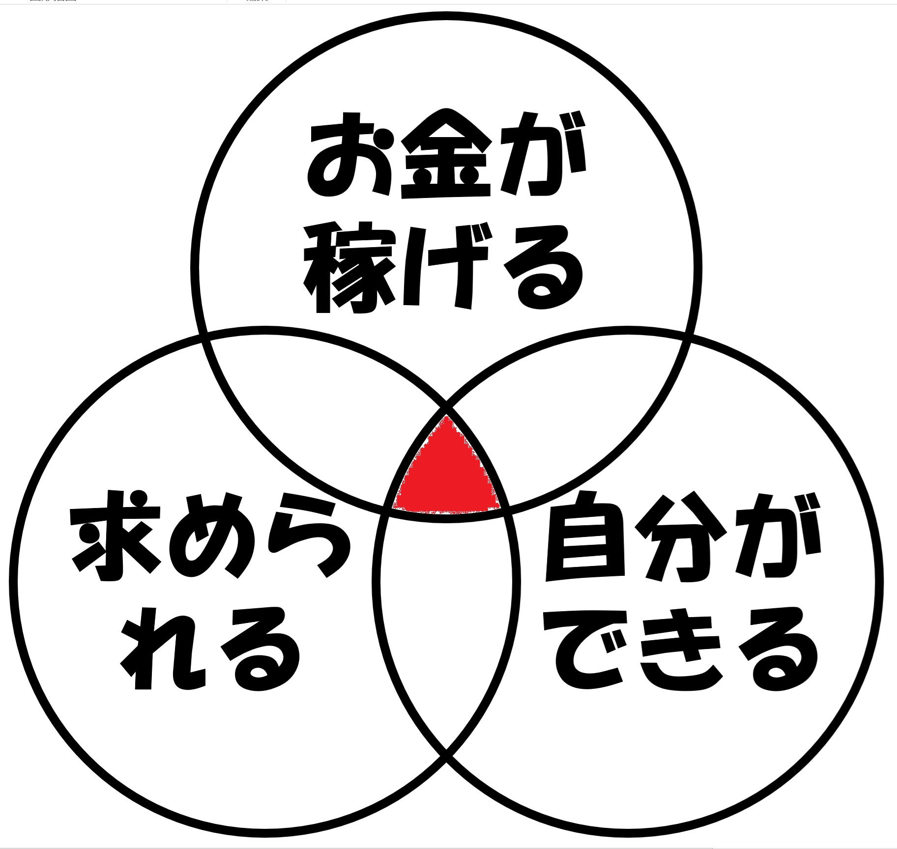
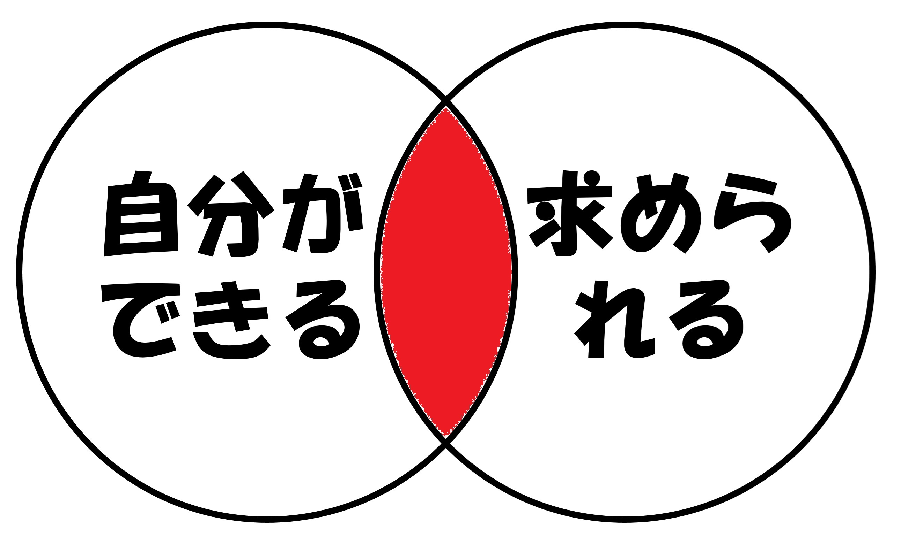

# 登壇・ＬＴを検討する際に思い浮かべる２つの◯

ふーれむ@ditflame

かつて、私もそうだったので非常にわかりみがあるのですが、勉強会やLTで、「何話したらいいんだ……？」となっている人、結構多い気がします。

なお私の場合は、最近は「２つの◯を思い浮かべる」というポイントに気づけた事で、勉強会やLTの話の内容の組み立てが非常に楽に（内容に合いやすく）なりました。（もちろん合同誌の寄稿や執筆もね！）

今日はなぜその着想に至ったのか、また２つの◯を使って実際に検討してみた過去の講演やLTについて、考えていた事をお伝えできればと思います。

## ３つの◯理論

この話の元々の原型は「フレフレゾーン（Hooray! Zone）」[^hooray]とか、「キャリアカウンセラーの壁に貼ってあるバッド・カデルの図」_[^LeanAnalytics]などと呼ばれるベン図になるのですが、（自分にとって）良い仕事を探すには３つの尺度があり、それを検討すると良い　という話があります。

[^hooray]: 元々のブログはどうも記事が消えてしまっているような感じ……　上手く探せませんでした。
[^LeanAnalytics]: Lean Analytics(オライリー・ジャパン) より引用 https://www.oreilly.co.jp/books/9784873117119/

ここでいう３つの尺度　というのは次の３つです。

 * 自分ができること(価値を出せるポイント)
 * 自分が得意なこと(他人から求められること)
 * お金が稼げること

適職を探す場合の観点として、この３つの◯が交差するポイントを上手く狙おう！というわけです。

## さて、これが講演だとどうなる？

さて、適職においての要点はわかりましたが、ここで講演やLTについて考えてみましょう。

エンジニアイベントでの講演やLT、稼げますか？　（普通だと）稼げませんね？　ということで「お金が稼げること」の◯は捨てます。潔く捨てましょう。

すると２つの◯が残りました。これが冒頭で述べた「２つの◯を思い浮かべる」の◯の正体です。

せっかくなのでそれぞれの論点についても触れておきましょう。

### 自分ができること　について

「自分ができること」というと難しく感じるかもしれませんが、一人が全ての要素を兼ね備える事はできません。ここでは具体的な例を挙げてみます。

例えば「〇〇環境で△△してみた」的なLTを想像してみてください。初心者であれば、いろんなポイントで詰まるケースが多いでしょう。書籍やブログの通りにやってみたつもりでも、いざやってみるとすんなりと上手くは動かないかもしれません。

なお「詰まって、それを克服する」過程には様々なブレークスルーがありますし、一般的に言われるところの**つよつよエンジニア**は、なまじ前提知識があるので初心者の気持ちになれない　という圧倒的なウィークポイントがあったりもします。

ちなみに、大抵のケースで経験というのは「その経験を得た人独自の経験」である事が多く[^project]（バックグラウンドも違うし、人員構成も違うし、環境も普通は違うからして）、実はあまり経験そのものには再現性が無いケースも多いのです。

[^project]: バックグラウンドも違うし、人員構成も違うし、環境も普通は違うからして、そうそう「完全な再現性」というのは無いのです。だってプロジェクトがほとんどだもの。

なので、深く理解出来ていて語れる場合には鋭い切り口で語れれば良いのですが、そうではなく「こういう所につまってしまった」というような内容の話をすると、「自分ができること」を結構正確に満たせるのではないか、と筆者は考えています。

### 自分が得意なこと(他人から求められること)

「自分が得意なこと」についてはこのままの言葉で捉えてしまうと難しく感じるのですが、「他人から求められること」に置き換えてみましょう。

勉強会やLT会において、「他人から求められること」ってなんでしょうか？

こういった場合は例えば、参加者の属性を考えてみたり、勉強会の過去講演を見てみると、ある程度の方向性や傾向性が見えてくる事があります。

参加者には特定の傾向や偏り（例えばITをわかっている層ばかり/そうではない、特定技術に特化した人が集まっている/集まってるわけではない　など）がないでしょうか？

### 実際にやってみた例１

筆者は以前、青年技術士を中心としたとある勉強会で講演をする事になりました。(※筆者は技術士試験に受かってないので技術士ではないです)筆者の「自分のできること」としては、ITに関する話は横断的にだいたい話はできるので、大枠としてはITの話をしよう　という事で、大枠は比較的速やかに決まりました。

さて、問題は「自分が得意なこと(他人から求められること)」です。

技術士の技術分野には２１部門あり、ITに造詣が深い方ばかり　という事でもありません。（むしろこの本を読んでくださっている方のほうが詳しいケースもありそうなぐらい）

このため、ITの応用理論を中心としたテーマでは盛り上がりに欠けそうだな　と判断し、応用理論についての講演案は全てボツにしました。

ITの基礎理論やIT以前の基礎理論を横断的に見た時に、他の分野の技術者が内容を持ち帰って使えそうで、シナジーが期待できそうなテーマがいくつかあったのですが、そのうちの一つに「ユニバーサルカラーデザイン」というものがありました。（分野的にはITとも言えるし、ユーザーインターフェースデザインとも言えるし、認知心理学とも言える内容になります。）
また、講演をした当時はオリンピックの開催前で、改めてのインフラ整備などの機運が高まって来ていた頃であり、時期的にも丁度旬な内容でした。

この内容で長尺の講演(※講演70分+質疑20分)を組み、講演したところ非常に盛況を頂きました。[^kanji]

[^kanji]: なお、その会の幹事の依頼まできました。試験通ってないんだけどええのんか？　と思いながら現在も幹事をさせていただいています……　ええのんか？

### 実際にやってみた例２

筆者は以前、とあるLT会でLTをする事になりました。このLT会、一つだけ縛りがあり、なんと「ガンダム縛り」です。

ガンダムをネタにITの話を面白く組み上げる必要があり、なかなかLTの制約としては厳しいものです。どう考えてもネタLTが多くなりそうなテーマなわけですが、ネタLTをそのまま素直にやってしまっても面白くないな……　と色々考えていたところ、ふと気づいた観点がありました。

とある作品[^seed]の冒頭、ガンダムのOSを手動で再構築し、動かないハズの機体を動かしてしまうシーンがあるのですが、今の知見を活かすとこの開発能力をちゃんと定量的に推定できるんじゃなかろうか……？　というものです。

[^seed]: 機動戦士ガンダムSEED https://www.gundam-seed.net/

このテーマを閃いた時、テーマ（ガンダムLT）から全く外れず、他の人と被りがなさそうでかつ、聞いている人にしっかり刺さりそうだなと感じました。

着想してしまったら申し込むしかありません。で、申し込んでからLTの完成までは実は結構紆余曲折があったのですが、何故か私の友人にエンベデッドシステムで論文書いたり研究をしている大学の先生などもいるので、そういった先生と意見交換などしながら情報を組み上げた結果、めちゃくちゃキレイにオチまで着地する事ができました。

なおそのLTはここ[^lt]に上がっています。

[^lt]: 【LIVE】IT×ガンダム／ライトニングトーク大会 vol.1～RPALTスピンオフLT会～ https://www.youtube.com/watch?v=L_2QbKFhPPw&t=1740s

## 実際に色々やってみて気づいた事

頭の中の考えている事や思っていることをさらけだすのは、最初は大変だし、ハードルも高そうに見えるのですが、ぶっちゃけLTや講演に失敗したとて会社で大きなミスをしたわけでなし、そんなに失うものはないはずなのです。（ここでは成功例を色々と書いていますが、私も講演をやり始めた頃は講演時間の半分ぐらいで講演内容が終わってしまい、後でえらく突っ込まれたりなどした経験もあります。）

最近はLT会も多いし、みんな優しい勉強会が本当に多いので、とりあえずはまずLTに気軽に申し込んでしまって、カラダをまず突っ込んでみてから考えるぐらいでも良いのかもしれません。

たぶんそれでも間に合います。LTならね。
