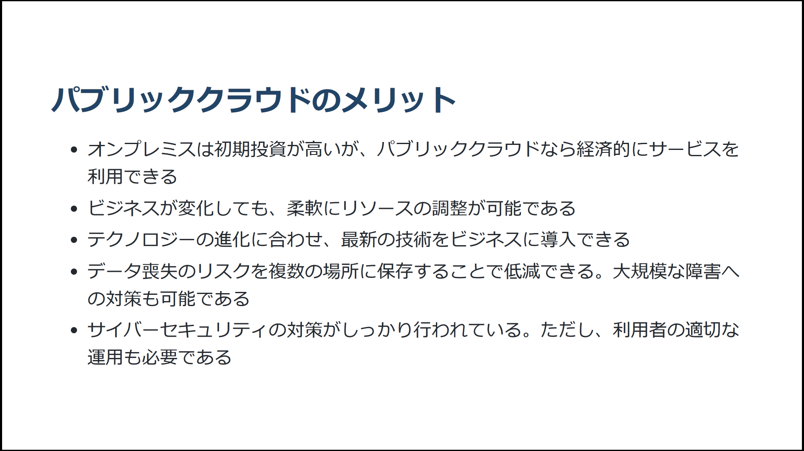
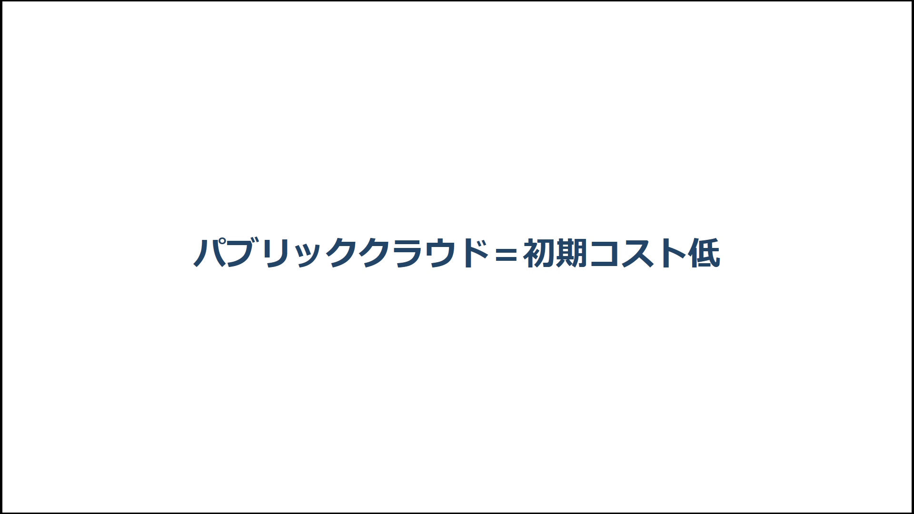

# 見出しを「本文」にする

岩本隆史 (iwamot)

筆者はLTスライドを作る際、見出しを「本文」にするよう心がけています。つまり、理想は**各ページの見出しをつなげて読むだけで理解できるスライド**です。そのようなスライドには、メリットがいくつかあると考えているからです。

本章では、見出しを本文にしたスライドのメリットについて、また、スライドの作成手順についてご説明します。

## メリット

見出しを本文にしたスライドに感じるメリットは、以下の3つです。

- 疲れていても理解しやすい
- オフラインイベントでも読みやすい
- 時間調整しやすい

### 疲れていても理解しやすい

仕事の後、疲れている状態でイベントに参加し、次のようなページを見せられると、理解に苦労します。

一方、見出しで言い切っているページだとどうでしょうか。

発表者の言いたいことが一目で伝わります。

### オフラインイベントでも読みやすい

オフラインイベントでは、スクリーンが遠かったり、前列の参加者の頭に隠れたりして、ページ全体を確認できないことがあります。

そんな状況で、文章に頼ったスライドを見せられたら、一部しか読めずにストレスを感じてしまうでしょう。

一方、見出しを本文にしたスライドなら、見出しさえ読めれば、発表者の言いたいことが理解できます。いくらスクリーンが遠くても、前列の参加者の座高が高くても、見出しは読めることが多いはずです。

### 時間調整しやすい

LTでは、緊張のせいで話しすぎ、持ち時間をオーバーしてしまいがちです。逆に、持ち時間を気にするあまり、だいぶ早く終わってしまうこともあります。

そんなふうにタイムキープが危ういときでも、見出しを本文にしたスライドだと、リカバリーしやすく感じます。時間が足りなさそうなら見出しだけ読み進めたり、逆に余りそうなら詳しい説明を加えたり、といった調整が柔軟にできるからです。

## スライド作成手順

見出しを本文にしたスライドを実際に作るには、下記の手順を踏むとよいでしょう。

1. 言いたいことをストーリーにまとめる
2. 見出しだけのスライドを作る
3. 必要ならビジュアルを追加する

### 言いたいことをストーリーにまとめる

まず、LTで言いたいことをストーリーにまとめます。LTは時間が限られているため、伝えるメッセージを絞り込む必要があります。どの情報をどの順で話すと明確に伝わるか、聞き手の視点でじっくり考えましょう。

ストーリーを考えずにスライドを作ると、説明が破綻しやすく、かえって修正に時間がかかってしまいます。急がば回れです。

### 見出しだけのスライドを作る

次に、まとめたストーリーに基づき、見出しだけのスライドを作ります。表紙以外の各ページは、見出しだけが書かれた状態です。

見出しでは、そのページで言いたいことを簡潔に表しましょう。たとえば「パブリッククラウドのメリットは初期コストが抑えられること」なら「パブリッククラウド＝初期コスト低」で十分です。

**完成したら、各ページの見出しを読み進め、発表内容が伝わるかどうかを確認します。**この段階ではビジュアルの考慮は不要です。

### 必要ならビジュアルを追加する

最後に、必要ならビジュアルを追加します。図・グラフ・イラストなどの視覚的要素を加えることで、見出しのメッセージを補足したり強化したりできるかもしれません。たとえば、見出しが「パブリッククラウド＝初期コスト低」の場合、オンプレミスと比較したグラフを追加すると効果的でしょう。

**ただし、ビジュアルの追加には注意が必要です。過剰なビジュアルは、かえって理解の妨げになります。**あくまでも見出しが主役なので、追加したビジュアルが見出しのメッセージを支えているかどうか、よく確認しましょう。

## 本章のまとめ

以上、見出しを本文にしたスライドのメリットと作成手順をご説明しました。参考になれば幸いです。

なお、本章の内容は、櫻田潤さんの『ビジュアルシンキング・プレゼンテーション　基本の書　ビジュアルで差がつく「響く」プレゼン資料作成術』（カドカワ・ミニッツブック）を自己流にアレンジしたものです。短くてユニークな本なので、ぜひあわせてお読みください。
